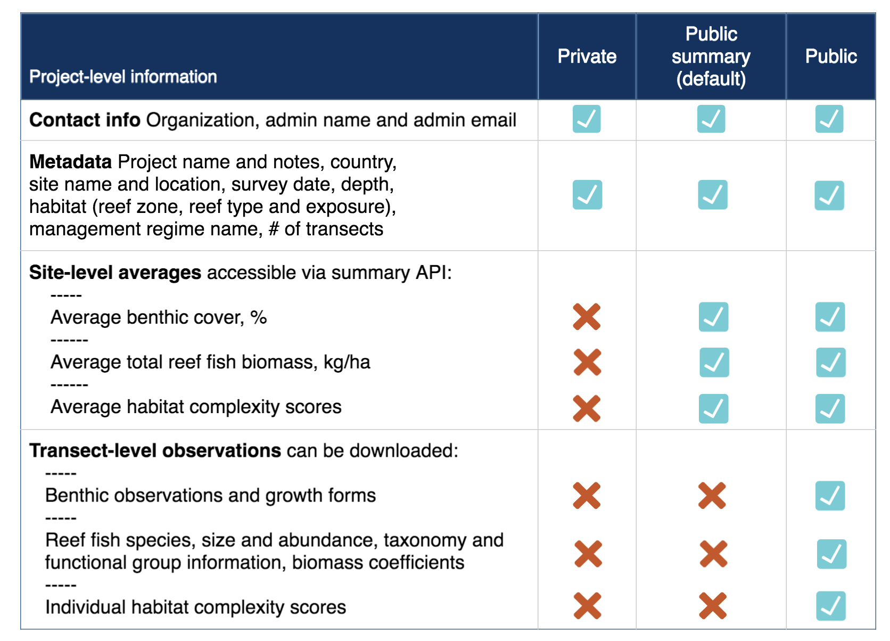

Aggregated views
================

MERMAID aggregated views are convenience resources that roll up many lookups and aggregate data at various levels with standardized calculations of common indicators, such as biomass. All aggregated views are read-only (i.e., support only ``GET`` requests). As with regular :doc:`projects`, aggregated view resources in MERMAID all begin, relative to the API root, with ``/projects/<project_id>/``, where ``<project_id>`` is the UUID of a project. See :doc:`getting_started` for how to determine a ``project_id`` manually, or use the API to retrieve a list of project ids to which a user has access using the :ref:`projects_resource` resource.

All views will return data in one of three formats:

- ``.../`` (i.e., default) or ``.../json/``: standard `JSON <https://www.json.org/json-en.html>`_, with ``content-type`` = ``application/json``
- ``.../csv/``: comma-separated 2D matrix (some fields are JSON), with ``content-type`` = ``text/csv``
- ``.../geojson/``: returns `GeoJSON <https://geojson.org/>`_ suitable for loading into a GIS (``content-type`` = ``application/json``)

| To request a CSV version of the resource, append ``.../csv/``, e.g.
| ``/projects/<project_id>/beltfishes/obstransectbeltfishes/csv/``
| To request a GeoJSOn version of the resource, append ``.../geojson/``, e.g.
| ``/projects/<project_id>/beltfishes/obstransectbeltfishes/geojson/``

| Aggregated view resources tend to support a wider array of filtering methods, including range (min/max) filters and, in particular, the ability to filter by multiple values, e.g.
| ``?management_rule=periodic%20closure,gear%20restriction``

.. note::
    Multiple-value comma-separated filters are marked with an asterix (*) in the resources below.

Covariates
----------

All aggregate views include a ``covariates`` field with a growing list of metrics retrieved from non-MERMAID sources for the referenced MERMAID site. The idea is to speed up analysis by including commonly regressed drivers with primary ecological data. To begin with, two covariates from our friends at the `Allen Coral Atlas <https://allencoralatlas.org/>`_ are included; a sample looks like this::

   "covariates": [
     {
       "id": "75963cf9-d72a-47f9-972f-f6879c3fba17",
       "name": "aca_geomorphic",
       "value": [
         {
           "area": 1950.2176,
           "name": "Inner Reef Flat"
         }
       ],
       "display": "Alan Coral Atlas Geomorphic",
       "datestamp": "2021-02-01",
       "requested_datestamp": "2021-02-01"
     },
     {
       "id": "55c2f2d9-7168-49ee-a05a-0f65c9e777b4",
       "name": "aca_benthic",
       "value": [
         {
           "area": 1815.5039000000002,
           "name": "Sand"
         },
         {
           "area": 134.71373,
           "name": "Rubble"
         }
       ],
       "display": "Alan Coral Atlas Benthic",
       "datestamp": "2021-02-01",
       "requested_datestamp": "2021-02-01"
     }
   ],

.. _data_sharing:

Data sharing policies
---------------------

Access to project data for all unauthenticated requests is based on the data sharing policy attached to each survey method for that project. Each survey method (e.g., fish belt transect) may be assigned one of three policies: ``private``, ``public summary`` (default), and ``public``. The three policies are summarized in the table below.

In practice, the data sharing policies mean that a user has access to data if they are authenticated and a member of the requested project, or unauthenticated and the relevant data sharing policy for the requested survey method and project is:

1. observation and sample unit views: ``public``
2. sample event views: ``public summary``
3. summary site view: unauthenticated; survey method-specific aggregations for each result if ``public summary`` or ``public``

.. _observations_views:

Observation views
-----------------

Observation views are the lowest level of MERMAID aggregate views, representing individual observations with all related data from site, project, management regime, and so on followed and relatively flattened into single rows, with row-level indicators like biomass calculated in a standardized way. The csv variants of observation views are what are called from the frontend ``Export to CSV`` button.

All aggregate-view resources at the observations level return data if **either**

1. user is authenticated and a member of the requested project, or
2. user is unauthenticated and the relevant data sharing policy for the requested survey method and project is ``public``

All aggregate-view resources at the observations level support the following filters:

- ``site_id`` *
- ``site_name`` *
- ``country_id`` *
- ``country_name`` *
- ``tag_id`` *
- ``tag_name`` *
- ``reef_type``
- ``reef_zone``
- ``reef_exposure``
- ``management_id`` *
- ``management_name`` *
- ``sample_event_id`` *
- ``sample_date_before``/``sample_date_after``
- ``management_est_year_min``/``management_est_year_max``
- ``management_size_min``/``management_size_max``
- ``management_party`` *
- ``management_compliance`` *
- ``management_rule`` *
- ``current_name`` *
- ``tide_name`` *
- ``visibility_name`` *
- ``label`` *
- ``depth_min``/``depth_max``
- ``relative_depth`` *
- ``observers`` *

/projects/<project_id>/beltfishes/obstransectbeltfishes/
^^^^^^^^^^^^^^^^^^^^^^^^^^^^^^^^^^^^^^^^^^^^^^^^^^^^^^^^

Flattened fish belt transect observations for a project. Additional filters:

- ``transect_len_surveyed_min``/``transect_len_surveyed_max``
- ``reef_slope`` *
- ``transect_number``
- ``fish_taxon`` *
- ``fish_family`` *
- ``fish_genus`` *
- ``trophic_group`` *
- ``trophic_level_min``/``trophic_level_max``
- ``functional_group`` *
- ``vulnerability_min``/``vulnerability_max``
- ``size_min``/``size_max``
- ``count_min``/``count_max``
- ``biomass_kgha_min``/``biomass_kgha_max``

/projects/<project_id>/benthiclits/obstransectbenthiclits/
^^^^^^^^^^^^^^^^^^^^^^^^^^^^^^^^^^^^^^^^^^^^^^^^^^^^^^^^^^

Flattened benthic LIT transect observations for a project. Additional filters:

- ``transect_len_surveyed_min``/``transect_len_surveyed_max``
- ``reef_slope`` *
- ``transect_number``
- ``length_min``/``length_max``
- ``benthic_category``
- ``benthic_attribute``
- ``growth_form``

/projects/<project_id>/benthicpits/obstransectbenthicpits/
^^^^^^^^^^^^^^^^^^^^^^^^^^^^^^^^^^^^^^^^^^^^^^^^^^^^^^^^^^

Flattened benthic PIT transect observations for a project. Additional filters:

- ``transect_len_surveyed_min``/``transect_len_surveyed_max``
- ``reef_slope`` *
- ``transect_number``
- ``interval_size_min``/``interval_size_max``
- ``interval_min``/``interval_max``
- ``benthic_category``
- ``benthic_attribute``
- ``growth_form``

/projects/<project_id>/habitatcomplexities/obshabitatcomplexities/
^^^^^^^^^^^^^^^^^^^^^^^^^^^^^^^^^^^^^^^^^^^^^^^^^^^^^^^^^^^^^^^^^^

Flattened habitat complexity transect observations for a project. Additional filters:

- ``transect_len_surveyed_min``/``transect_len_surveyed_max``
- ``reef_slope`` *
- ``transect_number``
- ``interval_min``/``interval_max``
- ``score``

/projects/<project_id>/bleachingqcs/obscoloniesbleacheds/
^^^^^^^^^^^^^^^^^^^^^^^^^^^^^^^^^^^^^^^^^^^^^^^^^^^^^^^^^

Flattened number of colonies bleached quadrat collection observations for a project. Additional filters:

- ``quadrat_size``
- ``benthic_attribute``
- ``growth_form``
- ``count_normal_min``/``count_normal_max``
- ``count_pale_min``/``count_pale_max``
- ``count_20_min``/``count_20_max``
- ``count_50_min``/``count_50_max``
- ``count_80_min``/``count_80_max``
- ``count_100_min``/``count_100_max``
- ``count_dead_min``/``count_dead_max``

/projects/<project_id>/bleachingqcs/obsquadratbenthicpercents/
^^^^^^^^^^^^^^^^^^^^^^^^^^^^^^^^^^^^^^^^^^^^^^^^^^^^^^^^^^^^^^

Flattened quadrat percent benthic cover observations for a project. Additional filters:

- ``quadrat_size``
- ``quadrat_number``
- ``percent_hard_min``/``percent_hard_max``
- ``percent_soft_min``/``percent_soft_max``
- ``percent_algae_min``/``percent_algae_max``

Sample Unit views
-----------------

.. note::
    In MERMAID it is possible to have two separate sample units that differ in metadata only by the ``label`` property; one scenario where this commonly happens is when a transect is surveyed in two passes, one for "big fish" and one for "little fish". One advantage of the aggregated sample unit views is that they provide standardized grouping logic for calculating aggregated indicators such as biomass.

All aggregate-view resources at the sample unit level return data if **either**

1. user is authenticated and a member of the requested project, or
2. user is unauthenticated and the relevant data sharing policy for the requested survey method and project is ``public``

All aggregate-view resources at the sample unit level support the same base filters as :ref:`observations views <observations_views>`.

/projects/<project_id>/beltfishes/sampleunits/
^^^^^^^^^^^^^^^^^^^^^^^^^^^^^^^^^^^^^^^^^^^^^^

Flattened fish belt sample units with calculated biomass for a project. Additional filters:

- ``transect_len_surveyed_min``/``transect_len_surveyed_max``
- ``reef_slope`` *
- ``transect_number``
- ``biomass_kgha_min``/``biomass_kgha_max``

/projects/<project_id>/benthiclits/sampleunits/
^^^^^^^^^^^^^^^^^^^^^^^^^^^^^^^^^^^^^^^^^^^^^^^

Flattened benthic LIT sample units with calculated calculated percent cover by benthic category for a project. Additional filters:

- ``transect_len_surveyed_min``/``transect_len_surveyed_max``
- ``reef_slope`` *
- ``transect_number``

/projects/<project_id>/benthicpits/sampleunits/
^^^^^^^^^^^^^^^^^^^^^^^^^^^^^^^^^^^^^^^^^^^^^^^

Flattened benthic PIT sample units with calculated percent cover by benthic category for a project. Additional filters:

- ``transect_len_surveyed_min``/``transect_len_surveyed_max``
- ``reef_slope`` *
- ``transect_number``
- ``interval_size_min``/``interval_size_max``

/projects/<project_id>/habitatcomplexities/sampleunits/
^^^^^^^^^^^^^^^^^^^^^^^^^^^^^^^^^^^^^^^^^^^^^^^^^^^^^^^

Flattened habitat complexity sample units with calculated average scores for a project. Additional filters:

- ``transect_len_surveyed_min``/``transect_len_surveyed_max``
- ``reef_slope`` *
- ``transect_number``
- ``score_avg_min``/``score_avg_max``

/projects/<project_id>/bleachingqcs/sampleunits/
^^^^^^^^^^^^^^^^^^^^^^^^^^^^^^^^^^^^^^^^^^^^^^^^

Flattened bleaching quadrat collection sample units with calculated averages for both colony count and percent benthic cover observations for a project. Additional filters:

- ``quadrat_size``
- ``count_genera_min``/``count_genera_max``
- ``count_total_min``/``count_total_max``
- ``percent_normal_min``/``percent_normal_max``
- ``percent_pale_min``/``percent_pale_max``
- ``percent_bleached_min``/``percent_bleached_max``
- ``quadrat_count_min``/``quadrat_count_max``
- ``percent_hard_avg_min``/``percent_hard_avg_max``
- ``percent_soft_avg_min``/``percent_soft_avg_max``
- ``percent_algae_avg_min``/``percent_algae_avg_max``

Sample Event views
------------------

MERMAID sample event views aggregate all data collected for a given survey method at a particular place on a particular date, providing a standardized calculation of aggregate metrics.

All aggregate-view resources at the sample event level return data if **either**

1. user is authenticated and a member of the requested project, or
2. user is unauthenticated and the relevant data sharing policy for the requested survey method and project is ``public summary`` or ``public``

All aggregate-view resources at the sample event level support the following filters:

- ``site_id`` *
- ``site_name`` *
- ``country_id`` *
- ``country_name`` *
- ``tag_id`` *
- ``tag_name`` *
- ``reef_type``
- ``reef_zone``
- ``reef_exposure``
- ``management_id`` *
- ``management_name`` *
- ``sample_event_id`` *
- ``sample_date_before``/``sample_date_after``
- ``management_est_year_min``/``management_est_year_max``
- ``management_size_min``/``management_size_max``
- ``management_party`` *
- ``management_compliance`` *
- ``management_rule`` *
- ``current_name`` *
- ``tide_name`` *
- ``visibility_name`` *

/projects/<project_id>/beltfishes/sampleevents/
^^^^^^^^^^^^^^^^^^^^^^^^^^^^^^^^^^^^^^^^^^^^^^^

Aggregated view of all fish belt transect data collected for a sample event. Additional filters:

- ``biomass_kgha_avg_min``/``biomass_kgha_avg_max``
- ``sample_unit_count_min``/``sample_unit_count_max``
- ``depth_avg_min``/``depth_avg_max``

/projects/<project_id>/benthiclits/sampleevents/
^^^^^^^^^^^^^^^^^^^^^^^^^^^^^^^^^^^^^^^^^^^^^^^^

Aggregated view of all benthic LIT transect data collected for a sample event. Additional filters:

- ``sample_unit_count_min``/``sample_unit_count_max``
- ``depth_avg_min``/``depth_avg_max``

/projects/<project_id>/benthicpits/sampleevents/
^^^^^^^^^^^^^^^^^^^^^^^^^^^^^^^^^^^^^^^^^^^^^^^^

Aggregated view of all benthic PIT transect data collected for a sample event. Additional filters:

- ``sample_unit_count_min``/``sample_unit_count_max``
- ``depth_avg_min``/``depth_avg_max``

/projects/<project_id>/habitatcomplexities/sampleevents/
^^^^^^^^^^^^^^^^^^^^^^^^^^^^^^^^^^^^^^^^^^^^^^^^^^^^^^^^

Aggregated view of all habitat complexity transect data collected for a sample event. Additional filters:

- ``sample_unit_count_min``/``sample_unit_count_max``
- ``depth_avg_min``/``depth_avg_max``
- ``score_avg_avg_min``/``score_avg_avg_max``

/projects/<project_id>/bleachingqcs/sampleevents/
^^^^^^^^^^^^^^^^^^^^^^^^^^^^^^^^^^^^^^^^^^^^^^^^^

Aggregated view of all bleaching quadrat collection data collected for a sample event. Additional filters:

- ``sample_unit_count_min``/``sample_unit_count_max``
- ``depth_avg_min``/``depth_avg_max``
- ``quadrat_size_avg_min``/``quadrat_size_avg_max``
- ``count_genera_avg_min``/``count_genera_avg_max``
- ``count_total_avg_min``/``count_total_avg_max``
- ``percent_normal_avg_min``/``percent_normal_avg_max``
- ``percent_pale_avg_min``/``percent_pale_avg_max``
- ``percent_bleached_avg_min``/``percent_bleached_avg_max``
- ``quadrat_count_avg_min``/``quadrat_count_avg_max``
- ``percent_hard_avg_avg_min``/``percent_hard_avg_avg_max``
- ``percent_soft_avg_avg_min``/``percent_soft_avg_avg_max``
- ``percent_algae_avg_avg_min``/``percent_algae_avg_avg_max``

Summary views
-------------

MERMAID provides two "summary" endpoints that aggregate metrics from **all** surveys associated with a Site, either for a specific Sample Event (i.e. on the same date) or for all dates. For each sample event or site, a ``protocols`` field contains an object for each survey method conducted at that site, with calculated indicators for each if the data sharing policy for that survey method is ``public summary`` or ``public``, and just ``sample_unit_count`` otherwise. These views additionally differ from other aggregated views because:

1. They are not project-specific; urls are relative to the API root. Thus ``/sampleevents/`` provides data for **all** surveys associated with each Site, while ``/projects/<project_id>/beltfishes/sampleevents/`` provides just beltfish data for a particular project.
2. They never require authentication
3. They are not refreshed immediately; under the hood, they draw from tables that are refreshed every 30 minutes.

Available filters:

- ``site_id`` *
- ``site_name`` *
- ``country_id`` *
- ``country_name`` *
- ``tag_id`` *
- ``tag_name`` *
- ``reef_type``
- ``reef_zone``
- ``reef_exposure``
- ``management_id`` *
- ``management_name`` *
- ``project_id`` *
- ``project_name`` *
- ``project_admins`` *
- ``date_min``/``date_max``
- ``data_policy_beltfish``
- ``data_policy_benthiclit``
- ``data_policy_benthicpit``
- ``data_policy_habitatcomplexity``
- ``data_policy_bleachingqc``

/summarysampleevents/
^^^^^^^^^^^^^^^^^^^^^

Provides aggregated results for each survey conducted at a given place on a given date.

/summarysites/
^^^^^^^^^^^^^^

Provides aggregated results for each survey conducted at a given place, across all dates. This resource is used by the `MERMAID public dashboard <https://dashboard.datamermaid.org/>`_.
