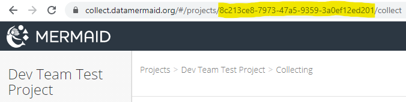

Using the API
=============

| Automatic swagger API documentation is not yet available (:doc:`volunteers welcome! <contributing>`). Instead, an API client file is provided for easy experimentation:
| `Insomnia collection <../../../mermaid_api.insomnia_collection.json>`_

| The API client `Insomnia <https://insomnia.rest/>`_ is required to use this file. You can also export to other clients such as `Postman <https://www.postman.com/>`_, but Insomnia is recommended for its ability to store things like authentication parameters as variables.
| `Details on how to import (and re-export to) other formats <https://support.insomnia.rest/article/172-importing-and-exporting-data>`_

Users may also inspect the code and console output from the above apps to see how the API is used in practice.

.. note::
   Most resources require a `JWT <https://jwt.io/>`_ token with every request; for more on this, see :doc:`authentication`.

The included Insomnia collection makes use of ``Environment``\s, which allow for the provision of arbitrary variables that can be used anywhere in the app. The ``prod`` environment, for example, defines ``api_url`` as ``https://api.datamermaid.org/v1``. In this way users can easily switch between testing in different environments (including ``local``).

Before you can start using the Insomnia collection, you need to:

1. Have or create a MERMAID user account appropriate to the targeted environment, easily obtainable by going to https://collect.datamermaid.org/ (production).

2. Change the ``project`` environment variable to the id of a project in MERMAID to which you belong, by copying/pasting from the Collect url, like this:

Formats
-------

All responses to GET requests for non-aggregated-view urls are returned as standard `JSON <https://www.json.org/json-en.html>`_, with
``content-type`` = ``application/json``. In addition, :doc:`aggregated` offer two additional formats, accessible by
appending the relevant string to resources:

- ``.../csv/``: returns comma-separated 2D matrix (some fields are JSON)
- ``.../geojson/``: returns `GeoJSON <https://geojson.org/>`_

``GET`` requests will return lists of objects. Appending an object id to most resources will return a single object.

Pagination
----------

All JSON and GeoJSON responses to GET requests are paginated with a default ``page_size`` of 100 that may be increased to a maximum of 5000 by appending a ``limit`` query parameter. Results contain ``count``, ``next``, and ``previous`` in addition to a list of actual ``results``, e.g.:::

    {
      "count": 3275,
      "next": "https://api.datamermaid.org/v1/fishspecies/?page=2",
      "previous": null,
      "results": [...]
    }

Filters
-------

| The included Insomnia collection contains examples of filters available for each resource, accessible from the `Query` tab of each request. In general, the basic "core" resources such as ``fishspecies`` support filtering by fields available from that resource, e.g.
| ``https://api.datamermaid.org/v1/fishspecies/?genus=f5263c54-ea12-4a18-8200-d52967376d1a``

| These resources also support ordering by field (or related field) names, e.g.
| ``https://api.datamermaid.org/v1/fishspecies/?ordering=genus__name``

| Many resources also allow limited searching via filters, e.g.:
| ``https://api.datamermaid.org/v1/fishspecies/?search=Abalistes``

| :doc:`aggregated` offer searching by multiple comma-separated values, e.g.
| ``https://api.datamermaid.org/v1/projects/8c213ce8-7973-47a5-9359-3a0ef12ed201/beltfishes/sampleunits/?site_name=KOE01,Lhok%20Weng``
